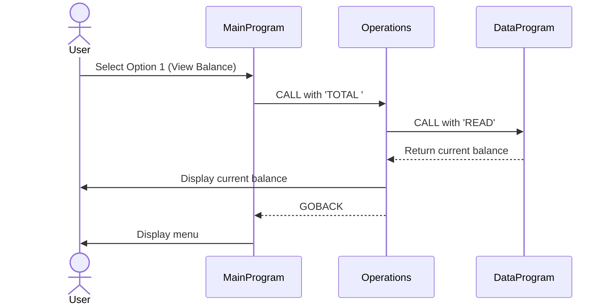
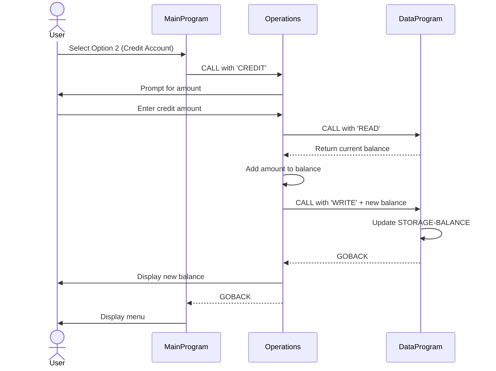
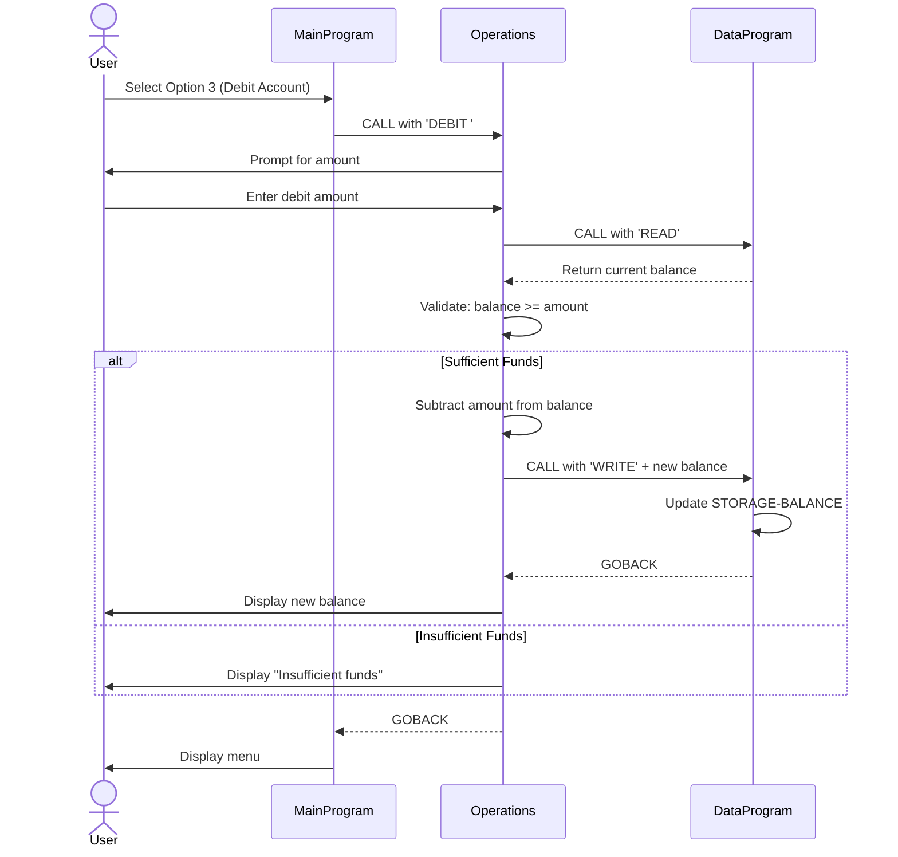
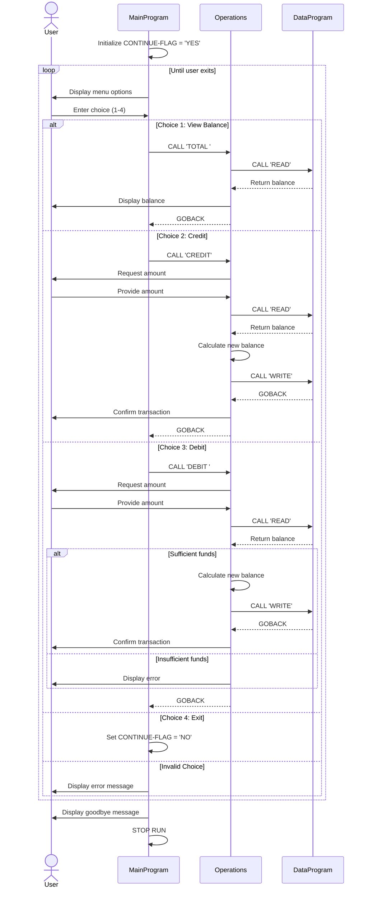

# COBOL Account Management System Documentation

## Overview

This is a legacy COBOL-based account management system designed to handle basic student account operations including balance inquiries, credits, and debits. The system follows a modular architecture with three main components working together to provide account management functionality.

## System Architecture

The application is structured into three interconnected COBOL programs:

1. **MainProgram** (main.cob) - User interface and program orchestration
2. **Operations** (operations.cob) - Business logic and transaction processing
3. **DataProgram** (data.cob) - Data persistence layer

## File Descriptions

### main.cob - MainProgram

**Purpose:** Serves as the entry point and user interface for the account management system.

**Key Functions:**
- Displays an interactive menu system for users
- Accepts user input for operation selection
- Routes requests to appropriate operation handlers
- Controls the main program execution loop

**Business Logic:**
- Presents 4 options to users:
  1. View Balance
  2. Credit Account
  3. Debit Account
  4. Exit
- Validates user input and rejects invalid menu choices
- Continues looping until user explicitly exits
- Calls the Operations module with specific operation codes:
  - `TOTAL ` for balance inquiries
  - `CREDIT` for account credits
  - `DEBIT ` for account debits

**Data Structure:**
- `USER-CHOICE`: Stores the user's menu selection (1-4)
- `CONTINUE-FLAG`: Controls the main program loop (YES/NO)

---

### operations.cob - Operations

**Purpose:** Implements core business logic for all account operations and acts as an intermediary between the UI and data layer.

**Key Functions:**
1. **Balance Inquiry (TOTAL):**
   - Retrieves current balance from DataProgram
   - Displays balance to user

2. **Credit Processing (CREDIT):**
   - Prompts user for credit amount
   - Reads current balance
   - Adds credit amount to balance
   - Updates balance in storage
   - Displays new balance

3. **Debit Processing (DEBIT):**
   - Prompts user for debit amount
   - Reads current balance
   - Validates sufficient funds
   - Processes debit if funds available
   - Updates balance in storage
   - Displays new balance or insufficient funds message

**Business Rules:**
- **Insufficient Funds Protection:** Debits are rejected if the requested amount exceeds the current balance
- **Immediate Processing:** All credits and debits are processed immediately with no pending state
- **Balance Verification:** The system reads the current balance before any transaction
- **Transaction Confirmation:** Users receive confirmation of new balance after each transaction

**Data Structure:**
- `OPERATION-TYPE`: Stores the type of operation to perform
- `AMOUNT`: Holds transaction amounts (up to 999,999.99)
- `FINAL-BALANCE`: Stores and calculates the account balance
- Default initial balance: 1000.00

---

### data.cob - DataProgram

**Purpose:** Manages data persistence for account balances, serving as a simple in-memory data storage layer.

**Key Functions:**
1. **READ Operation:**
   - Retrieves the current stored balance
   - Returns balance to calling program

2. **WRITE Operation:**
   - Updates the stored balance with new value
   - Persists changes for subsequent operations

**Business Logic:**
- Acts as a centralized storage mechanism for the account balance
- Maintains data consistency across operations
- Provides abstraction layer between business logic and data storage

**Data Structure:**
- `STORAGE-BALANCE`: Persistent storage for account balance (up to 999,999.99)
- Initial balance: 1000.00
- `OPERATION-TYPE`: Determines whether to READ or WRITE data
- `PASSED-OPERATION`: Receives operation type from caller
- `BALANCE`: Interface for passing balance values between programs

---

## Student Account Business Rules

### Account Initialization
- All student accounts start with a default balance of **1,000.00** (currency units not specified in code)
- Balance is initialized when DataProgram is first loaded

### Transaction Rules
1. **Credit Transactions:**
   - No maximum limit specified
   - Credits are applied immediately
   - Must be positive amounts (implied by PIC format)
   - Maximum single transaction: 999,999.99

2. **Debit Transactions:**
   - Subject to insufficient funds check
   - Cannot debit more than current balance (no overdraft allowed)
   - Debits are applied immediately if approved
   - Must be positive amounts (implied by PIC format)
   - Maximum single transaction: 999,999.99

3. **Balance Constraints:**
   - Maximum balance: 999,999.99 (6 digits + 2 decimal places)
   - Minimum balance: 0.00 (enforced by debit validation)
   - No negative balances permitted

### Data Integrity
- Balance is stored in a centralized location (DataProgram)
- All operations read the current balance before modification
- Updates are written back immediately after calculation
- No transaction history or audit trail is maintained in current implementation

### User Interface Rules
- Menu-driven interaction only
- Invalid menu choices are rejected with error message
- Program continues until user explicitly exits
- Clear confirmation messages provided for all operations

## Technical Specifications

### Data Types
- **Balance Fields:** PIC 9(6)V99 (6 digits with 2 decimal places)
- **Operation Codes:** PIC X(6) (6-character alphanumeric)
- **Menu Choice:** PIC 9 (single digit)

### Program Communication
- Inter-program communication via `CALL` statements
- Parameters passed using `USING` clause
- Programs return control via `GOBACK` statement

### Operation Codes
- `READ` - Retrieve balance from storage
- `WRITE` - Update balance in storage
- `TOTAL ` - View current balance (note trailing space)
- `CREDIT` - Add funds to account
- `DEBIT ` - Remove funds from account (note trailing space)

## Limitations and Considerations

1. **Data Persistence:** Balance is stored in-memory only; no file or database persistence
2. **Single User:** No multi-user support or concurrency control
3. **No Authentication:** No user identification or security features
4. **No Transaction History:** Previous transactions are not logged or tracked
5. **Limited Error Handling:** Basic validation only for insufficient funds
6. **Currency:** No currency specification or multi-currency support
7. **Rounding:** Standard COBOL numeric rounding applies to decimal calculations

## Future Modernization Opportunities

When modernizing this legacy system, consider:
- Adding database persistence
- Implementing user authentication and authorization
- Creating transaction history and audit trails
- Adding reporting capabilities
- Implementing concurrent access controls
- Expanding error handling and input validation
- Adding support for multiple account types
- Implementing overdraft protection options
- Creating automated testing suite

## Application Data Flow

The following sequence diagrams illustrate the data flow through the system for each operation type.

### View Balance Flow

### Credit Account Flow

### Debit Account Flow (Sufficient Funds)

### Complete Application Loop

### Key Data Flow Patterns

1. **Layered Architecture:**
   - User interface (MainProgram) is separated from business logic (Operations)
   - Business logic is separated from data storage (DataProgram)
   - Each layer communicates through well-defined interfaces

2. **Synchronous Processing:**
   - All operations are blocking and synchronous
   - Each CALL waits for GOBACK before continuing
   - No asynchronous or concurrent operations

3. **Stateless Operations Layer:**
   - Operations program does not maintain state between calls
   - Each operation is self-contained
   - State is centralized in DataProgram

4. **Read-Modify-Write Pattern:**
   - All modifications follow: READ current value → MODIFY value → WRITE new value
   - Ensures data consistency for transactions

5. **Centralized Data Access:**
   - Only DataProgram directly accesses STORAGE-BALANCE
   - Operations never directly modifies stored data
   - Provides single source of truth for balance
